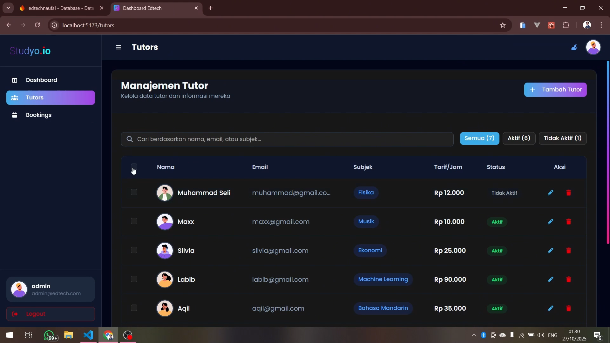
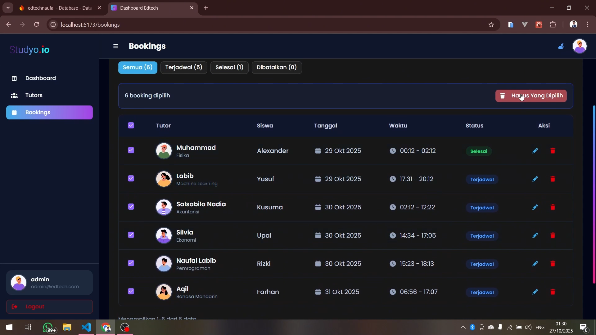

t

# 🎓 EdTech Dashboard - Platform Manajemen Pembelajaran


Platform dashboard interaktif untuk mengelola tutor dan booking sesi pembelajaran dengan fitur real-time analytics, dark mode, smart sorting, dan responsive design.

## 📋 Daftar Isi

* Tentang Proyek
* Fitur Utama
* Teknologi yang Digunakan
* Struktur Folder
* Instalasi dan Setup
* Konfigurasi Firebase
* Menjalankan Aplikasi
* Fitur Detail
* Screenshot
* Arsitektur Aplikasi
* Kontak

## 📖 Tentang Proyek

**EdTech Dashboard** adalah aplikasi web berbasis React.js yang dirancang untuk mengelola platform pembelajaran matematika interaktif. Aplikasi ini menyediakan interface admin yang lengkap dengan fitur manajemen tutor, penjadwalan booking, serta dashboard analytics yang informatif dengan real-time data synchronization.

Proyek ini dibuat sebagai bagian dari **Technical Test Web Developer Internship** di EdTech Indonesia, dengan fokus pada:

* ✅ Implementasi CRUD (Create, Read, Update, Delete) lengkap
* ✅ Integrasi Firebase (Authentication & Firestore)
* ✅ State Management dengan Redux Toolkit
* ✅ UI/UX responsif dengan TailwindCSS
* ✅ Dark Mode Support
* ✅ Real-time Data Synchronization
* ✅ Smart Data Sorting & Filtering
* ✅ Dynamic Analytics & Growth Tracking

## ✨ Fitur Utama

### 🔐 Authentication

* Login dengan Firebase Authentication (Email & Password)
* Protected Routes untuk keamanan aplikasi
* Logout dengan konfirmasi dialog
* Session management otomatis
* Loading states yang smooth

### 📊 Dashboard Analytics

* **Dynamic Statistics Cards** :
* Total Tutors dengan jumlah tutor aktif
* Total Bookings dengan jumlah completed
* Upcoming Sessions (3 hari ke depan)
* **Growth Percentage** - Perhitungan dinamis perbandingan booking minggu ini vs minggu lalu
* **Weekly Bookings Chart** :
* Visualisasi data booking 7 hari terakhir menggunakan Recharts
* Area chart dengan gradient Study.io branding
* Interactive tooltip dengan informasi detail
* Real-time data dari Firebase
* Dynamic trend indicator (up/down dengan percentage)
* **Upcoming Sessions** :
* Daftar sesi pembelajaran 3 hari ke depan
* **Smart sorting by date & time** (nearest first)
* Avatar tutor dengan fallback
* Pagination support
* **Latest Tutors** :
* Preview tutor terbaru
* **Prioritized newest tutors** (sorted by creation date)
* Status badge dan hourly rate
* Pagination support
* Real-time data updates dari Firestore

### 👨‍🏫 Manajemen Tutor

* **CRUD Operations** :
* Create, Read, Update, Delete tutor
* Form validation komprehensif
* Real-time updates
* **Smart Data Management** :
* **Newest tutors appear first** - Otomatis prioritas data terbaru di atas
* Tutors sorted by creation date (descending)
* **Bulk Actions** :
* **Multi-select tutors** dengan checkbox
* **Bulk delete** dengan validation
* Check tutors dengan booking aktif sebelum delete
* Warning untuk tutors yang tidak bisa dihapus
* **Filtering & Search** :
* Search real-time berdasarkan nama, email, atau subjek
* Filter berdasarkan status (All, Active, Inactive)
* Badge counter untuk setiap filter
* **UI Features** :
* Tabel responsif dengan pagination
* Avatar generator otomatis
* 24+ subjects selection
* Hourly rate dalam format Rupiah (Rp)
* Empty states dengan ilustrasi

### 📅 Manajemen Booking

* **CRUD Operations** :
* Create, Read, Update, Delete booking
* Form validation lengkap
* Real-time sync dengan Firestore
* **Smart Data Management** :
* **Automatic sorting by nearest date & time** - Booking terdekat selalu di atas
* Re-sort otomatis setelah add/edit
* Consistent sorting across all views
* **Bulk Actions** :
* **Multi-select bookings** dengan checkbox
* **Bulk delete** untuk hapus multiple bookings sekaligus
* Confirmation dialog untuk safety
* Success/error feedback dengan toast
* **Filtering** :
* Filter berdasarkan status: Scheduled, Completed, Cancelled
* Badge counter per status
* All bookings view
* **Form Features** :
* Dropdown tutor dengan informasi lengkap (nama, subject, rate)
* Tutor info card setelah selection
* Date picker (tidak boleh masa lalu)
* Time validation (end time > start time)
* Warning alert jika belum ada tutor aktif
* **UI Features** :
* Responsive table dengan avatar
* Pagination dengan kustomisasi items per page
* Status badges dengan color coding
* Format tanggal Indonesia
* Empty states kondisional

### 🎨 UI/UX Features

* **Dark Mode** :
* Toggle tema terang/gelap di header
* Smooth transitions
* Persistent preference (localStorage)
* Support untuk semua komponen
* **Skeleton Loading** :
* Informative loading states
* Menyerupai layout final
* Dark mode support
* **Toast Notifications** (Sonner):
  * Success, Error, Warning, Info notifications
  * Position: top-right
  * Rich colors
  * Auto-dismiss
* **Responsive Design** :
* Mobile-first approach
* Breakpoints: mobile, tablet, desktop
* Sidebar collapse di mobile dengan overlay
* Touch-friendly buttons
* **Custom Scrollbar** :
* Gradient scrollbar dengan Study.io branding
* Smooth hover effects
* Dark mode variant
* **Empty States** :
* Ilustrasi icon
* Descriptive messages
* Call-to-action buttons
* Kondisional berdasarkan context (search vs no data)
* **Form Validation** :
* Real-time error messages
* Required field indicators (*)
* Border highlighting untuk errors
* Auto-clear errors saat typing

## 🛠 Teknologi yang Digunakan

### Core Technologies

* **React 19.1.1** - UI Library
* **Vite 7.1.7** - Build Tool & Dev Server
* **React Router DOM 7.9.4** - Client-side Routing

### State Management

* **Redux Toolkit 2.9.2** - State Management dengan async thunks
* **React Redux 9.2.0** - React bindings untuk Redux

### Backend & Database

* **Firebase 12.4.0** :
* Firebase Authentication - User authentication
* Cloud Firestore - NoSQL database dengan real-time sync

### UI Framework & Styling

* **TailwindCSS 4.1.16** - Utility-first CSS Framework
* **@tailwindcss/vite 4.1.16** - Tailwind Vite Plugin
* **tw-animate-css 1.4.0** - Animation utilities
* **Radix UI** - Headless accessible UI Components:
  * @radix-ui/react-dialog
  * @radix-ui/react-select
  * @radix-ui/react-alert-dialog
  * @radix-ui/react-checkbox
  * @radix-ui/react-separator
  * @radix-ui/react-label

### Data Visualization & Icons

* **Recharts 2.15.4** - Chart library untuk dashboard analytics
* **FontAwesome 7.1.0** - Comprehensive icon library

### Additional Libraries

* **Sonner 2.0.7** - Modern toast notifications
* **next-themes 0.4.6** - Theme management system
* **clsx & tailwind-merge** - Conditional className utilities

## 📁 Struktur Folder

```
EDTECH_NAUFAL/
│
├── src/
│   ├── assets/
│   │   └── main.css                    # Global styles & TailwindCSS config
│   │
│   ├── components/
│   │   ├── ui/                         # Reusable UI components (ShadcnUI)
│   │   ├── BookingCard.jsx             # Booking table row component
│   │   ├── BookingForm.jsx             # Add/Edit booking modal form
│   │   ├── Layout.jsx                  # Main layout with sidebar & header
│   │   ├── mode-toggle.jsx             # Dark/Light theme toggle
│   │   ├── Pagination.jsx              # Reusable pagination component
│   │   ├── ProtectedRoute.jsx          # Authentication route guard
│   │   ├── theme-provider.jsx          # Theme context provider
│   │   ├── TutorCard.jsx               # Tutor table row component
│   │   └── TutorForm.jsx               # Add/Edit tutor modal form
│   │
│   ├── contexts/
│   │   └── theme-context.js            # Theme context definition
│   │
│   ├── hooks/
│   │   ├── use-auth.js                 # Custom hook untuk authentication
│   │   └── use-theme.js                # Custom hook untuk theme management
│   │
│   ├── lib/
│   │   └── utils.js                    # Utility functions (cn helper)
│   │
│   ├── pages/
│   │   ├── Bookings.jsx                # Bookings management page
│   │   ├── Dashboard.jsx               # Dashboard with analytics
│   │   ├── Login.jsx                   # Login page
│   │   └── Tutors.jsx                  # Tutors management page
│   │
│   ├── services/
│   │   ├── firebase.js                 # Firebase configuration
│   │   └── firestoreHelpers.js         # Firestore CRUD operations
│   │
│   ├── store/
│   │   ├── slices/
│   │   │   ├── authSlice.js            # Authentication state
│   │   │   ├── bookingsSlice.js        # Bookings state & async thunks
│   │   │   └── tutorsSlice.js          # Tutors state & async thunks
│   │   └── store.js                    # Redux store configuration
│   │
│   ├── App.jsx                         # Main app component with routing
│   └── main.jsx                        # App entry point
│
├── public/
│   ├── edtech_logo.svg                 # App logo
│   ├── edtech_login.png                # Login illustration
│   └── edtech_title.png                # Title logo
|
├── .env.example                        # Environment variables template
├── .gitignore                          # Git ignore rules
├── package.json                        # Dependencies & scripts
├── vite.config.js                      # Vite configuration
└── README.md                           # Project documentation
```

## 🚀 Instalasi dan Setup

### Prerequisites

Pastikan Anda telah menginstal:

* **Node.js** (v18.x atau lebih tinggi)
* **npm** atau **yarn** atau **pnpm**
* **Git**
* Akun **Firebase** (untuk konfigurasi backend)

### Langkah 1: Clone Repository

```bash
git clone https://github.com/Naufallabibb/edtech-dashboard-naufal.git
cd edtech-dashboard-naufal
```

### Langkah 2: Install Dependencies

```bash
npm install
# atau
yarn install
# atau
pnpm install
```

### Langkah 3: Setup Environment Variables

1. Copy file `.env.example` menjadi `.env`:

```bash
cp .env.example .env
```

2. Buka file `.env` dan isi dengan kredensial Firebase Anda:

```env
VITE_FIREBASE_API_KEY=your_api_key_here
VITE_FIREBASE_AUTH_DOMAIN=your_auth_domain_here
VITE_FIREBASE_PROJECT_ID=your_project_id_here
VITE_FIREBASE_STORAGE_BUCKET=your_storage_bucket_here
VITE_FIREBASE_MESSAGING_SENDER_ID=your_messaging_sender_id_here
VITE_FIREBASE_APP_ID=your_app_id_here
```

## 🔥 Konfigurasi Firebase

### 1. Buat Project Firebase

1. Kunjungi [Firebase Console](https://console.firebase.google.com/)
2. Klik **"Add Project"** atau **"Create a project"**
3. Berikan nama project (contoh: `edtech-dashboard-naufal`)
4. Ikuti wizard setup hingga selesai

### 2. Enable Authentication

1. Di Firebase Console, pilih project Anda
2. Buka **Authentication** > **Sign-in method**
3. Enable **Email/Password** provider
4. Klik **Save**

### 3. Create Firestore Database

1. Buka **Firestore Database** dari sidebar
2. Klik **"Create database"**
3. Pilih **Start in production mode**
4. Pilih location server (pilih yang terdekat, misalnya `asia-southeast1`)
5. Klik **Enable**

### 4. Set Firestore Security Rules

Setelah database dibuat, buka **Rules** tab dan ganti dengan:

```javascript
rules_version = '2';
service cloud.firestore {
  match /databases/{database}/documents {
    // Allow authenticated users to read and write all documents
    match /{document=**} {
      allow read, write: if request.auth != null;
    }
  }
}
```

Klik **Publish** untuk menerapkan rules.

### 5. Create User Account

Di Firebase Console:

1. Buka **Authentication** > **Users**
2. Klik **"Add user"**
3. Masukkan email: `admin@edtech.com`
4. Masukkan password: `admin123` (atau password pilihan Anda)
5. Klik **"Add user"**

### 6. Get Firebase Configuration

1. Di Firebase Console, klik **⚙️ Settings** > **Project settings**
2. Scroll ke bawah ke section **"Your apps"**
3. Klik icon **Web** (`</>`) untuk menambahkan web app
4. Berikan nickname (contoh: `edtech-web-admin`)
5. **JANGAN** centang Firebase Hosting
6. Klik **Register app**
7. Copy konfigurasi Firebase yang muncul
8. Paste nilai-nilai tersebut ke file `.env` Anda

## 🏃‍♂️ Menjalankan Aplikasi

### Development Mode

```bash
npm run dev
```

Aplikasi akan berjalan di: `http://localhost:5173`

### Build untuk Production

```bash
npm run build
```

Output build akan tersimpan di folder `dist/`

### Preview Production Build

```bash
npm run preview
```

### Login Credentials (Development)

```
Email: admin@edtech.com
Password: admin123
```

*Note: Sesuaikan dengan credentials yang Anda buat di Firebase Authentication*

## 🎯 Fitur Detail

### 1. Authentication Flow

* **Login Page** (`/login`):
  * Form dengan validasi email dan password
  * Password visibility toggle
  * Error handling dengan toast notification
  * Redirect otomatis ke dashboard setelah login
  * Responsive design dengan ilustrasi di desktop
* **Protected Routes** :
* Semua route kecuali `/login` memerlukan autentikasi
* Redirect otomatis ke login jika belum login
* Loading state saat memeriksa auth status
* **Logout** :
* Konfirmasi dialog sebelum logout
* Clear session dan redirect ke login
* Toast notification untuk feedback

### 2. Dashboard Analytics

* **Dynamic Statistics Cards** :
* **Total Tutors** : Jumlah total dengan breakdown aktif/tidak aktif
* **Total Bookings** : Jumlah total dengan completed count
* **Upcoming Sessions** : Count 3 hari ke depan
* **Growth Percentage** :
  * Perhitungan dinamis berdasarkan data real dari Firebase
  * Comparison minggu ini (7 hari terakhir) vs minggu lalu (7 hari sebelumnya)
  * Color-coded: Hijau (positive), Merah (negative)
  * Format: +X% atau -X%
* **Weekly Bookings Chart** :
* Visualisasi area chart dengan Recharts
* Data 7 hari terakhir dari Firebase
* Gradient fill dengan Study.io branding
* Interactive tooltip menampilkan jumlah booking per hari
* Dynamic trend text: "Trending up/down by X% minggu ini"
* Total bookings counter minggu ini
* **Upcoming Sessions List** :
* **Smart sorting** : Booking terdekat muncul paling atas
* Sort by date (ascending) kemudian by start time
* Menampilkan 3 hari ke depan
* Avatar tutor dengan fallback
* Info lengkap: tutor, siswa, subjek, tanggal, waktu
* Pagination support (5, 10, 20 items per page)
* Link "Lihat Semua" ke halaman Bookings
* **Latest Tutors List** :
* **Prioritized newest tutors** : Data terbaru di atas
* Sort by createdAt (descending)
* Avatar dengan ring border
* Status badge dengan color coding
* Hourly rate format Rupiah
* Pagination support
* Link "Lihat Semua" ke halaman Tutors

### 3. Tutors Management

* **Smart Data Management** :
* **Newest tutors appear first** secara otomatis
* Sort by creation timestamp (newest first)
* Add new tutor → langsung muncul di posisi teratas
* Konsisten across all views dan pagination
* **List View** :
* Tabel responsif dengan kolom lengkap
* **Multi-select dengan checkbox** untuk bulk actions
* Search real-time (nama, email, subjek)
* Filter by status dengan badge counter
* Avatar generator otomatis
* Pagination kustomisasi (5, 10, 20, 50 per halaman)
* Empty state dengan ilustrasi
* **Bulk Delete** :
* **Select multiple tutors** dengan checkbox header (select all)
* Bulk actions bar muncul saat ada selection
* "Hapus Yang Dipilih" button dengan counter
* Validation: Check setiap tutor apakah memiliki booking aktif
* Warning message untuk tutors yang tidak bisa dihapus
* Partial success handling (delete yang bisa, skip yang punya booking)
* Toast feedback: "Berhasil menghapus X tutor" atau "X tutor gagal karena masih ada booking"
* **Add/Edit Tutor** :
* Modal form dengan validasi
* Fields: Name, Email, Subject (dropdown 24+ pilihan), Hourly Rate, Status
* Real-time error messages
* Required field indicators (*)
* Auto-format hourly rate
* Loading state pada submit
* **Delete Single Tutor** :
* Konfirmasi dialog
* Validation: Cek booking aktif
* Error handling
* Toast feedback

### 4. Bookings Management

* **Smart Data Management** :
* **Automatic sorting by nearest date & time**
* Bookings terdekat selalu muncul paling atas
* Sort by date (ascending) → start time (ascending)
* Re-sort otomatis setelah:
  * Add new booking
  * Edit booking (date/time berubah)
* Konsisten di semua views (All, Scheduled, Completed, Cancelled)
* **List View** :
* Tabel responsif dengan avatar tutor
* **Multi-select dengan checkbox** untuk bulk actions
* Filter by status dengan badge counter
* Format tanggal Indonesia (e.g., "27 Okt 2025")
* Time range display (03:33 - 14:12)
* Status badges dengan color coding:
  * Terjadwal (Blue)
  * Selesai (Green)
  * Dibatalkan (Red)
* Pagination support
* Warning alert jika belum ada tutor aktif
* **Bulk Delete** :
* **Select multiple bookings** dengan checkbox header
* Bulk actions bar dengan counter
* "Hapus Yang Dipilih" button
* Confirmation dialog untuk safety
* Delete all selected sekaligus
* Toast feedback: "Berhasil menghapus X booking"
* Error handling per booking (partial delete support)
* **Add/Edit Booking** :
* Modal form 2-column di desktop
* Tutor dropdown dengan info lengkap (nama, subject, rate per jam)
* Tutor info card setelah selection
* Fields: Tutor, Student Name, Date, Time (Start & End), Status
* Validasi:
  * Date tidak boleh masa lalu (min: today)
  * End time > start time
  * All required fields
* Date & time pickers native HTML5
* Disabled jika belum ada tutor aktif
* **Delete Single Booking** :
* Konfirmasi dialog
* Toast feedback

### 5. UI/UX Enhancements

* **Dark Mode** :
* Toggle di header dengan icon sun/moon
* Smooth transitions
* Persistent (localStorage)
* Support semua komponen
* Color adjustments untuk readability
* **Skeleton Loading** :
* Informative loading states
* Layout menyerupai final content
* Dark mode support
* Minimum loading time (1 detik) untuk UX
* **Toast Notifications** :
* Success (hijau), Error (merah), Warning (kuning), Info (biru)
* Position: top-right
* Rich colors dengan dark mode support
* Auto-dismiss (3-5 detik)
* Descriptive messages
* **Responsive Design** :
* Mobile-first approach
* Breakpoints: sm (640px), md (768px), lg (1024px), xl (1280px)
* Sidebar collapse dengan overlay di mobile
* Responsive tables dengan horizontal scroll
* Touch-friendly buttons (min 44x44px)
* Stacked layouts di mobile
* **Custom Scrollbar** :
* Gradient Study.io branding (blue → purple → pink)
* Smooth hover effects
* Dark mode variant (lebih terang)
* Hidden scrollbar untuk dashboard cards (show on hover)
* **Empty States** :
* Icon illustrations (FontAwesome)
* Descriptive messages
* CTA buttons (e.g., "Tambah Tutor Pertama")
* Kondisional:
  * Search result empty vs no data
  * Filter result empty vs no data
  * Different message per context

## 📸 Screenshot

### Login Page

*Clean dan modern login interface dengan ilustrasi di desktop*


### Dashboard

*Overview analytics dengan dynamic growth tracking and weekly chart*


### Tutors Management

*Complete CRUD dengan bulk delete and smart sorting (newest first)*



### Bookings Management

*Comprehensive scheduler dengan sorting by nearest date and bulk delete*



### Dark Mode

*Full dark mode support dengan smooth transitions*


### Mobile Responsive

*Optimized untuk mobile devices dengan sidebar collapse*


## 🏗 Arsitektur Aplikasi

### State Management (Redux Toolkit)

Aplikasi menggunakan Redux Toolkit dengan struktur slice untuk setiap domain:

```
store/
├── store.js              # Configure store dengan middleware
└── slices/
    ├── authSlice.js      # Authentication state & thunks
    ├── tutorsSlice.js    # Tutors state & async CRUD thunks
    └── bookingsSlice.js  # Bookings state & async CRUD thunks
```

**Async Thunks:**

* `loginUser` - Login authentication
* `logoutUser` - Logout dan clear session
* `fetchTutors` - Get all tutors (sorted newest first)
* `addTutor` - Create new tutor (auto appears on top)
* `editTutor` - Update existing tutor
* `removeTutor` - Delete tutor
* `fetchBookings` - Get all bookings (sorted by nearest date)
* `fetchUpcomingBookings` - Get upcoming 3 days (sorted)
* `fetchWeeklyBookingsData` - Get weekly chart data
* `addBooking` - Create new booking (auto-sorted)
* `editBooking` - Update booking (re-sorted if date/time changed)
* `removeBooking` - Delete booking

### Smart Sorting Implementation

**Tutors Sorting:**

```javascript
// Sort by createdAt descending (newest first)
tutors.sort((a, b) => {
  const dateA = new Date(a.createdAt || 0);
  const dateB = new Date(b.createdAt || 0);
  return dateB - dateA; // Newest first
});
```

**Bookings Sorting:**

```javascript
// Sort by date & time ascending (nearest first)
bookings.sort((a, b) => {
  // Compare dates first
  const dateCompare = a.date.localeCompare(b.date);
  if (dateCompare !== 0) return dateCompare;
  // If dates equal, compare start times
  return a.startTime.localeCompare(b.startTime);
});
```

**Dynamic Growth Calculation:**

```javascript
// Calculate growth: current week vs previous week
const currentWeekBookings = bookings.filter(b => 
  b.date >= currentWeekStart && b.date <= currentWeekEnd
).length;

const previousWeekBookings = bookings.filter(b => 
  b.date >= previousWeekStart && b.date <= previousWeekEnd
).length;

const growth = ((currentWeekBookings - previousWeekBookings) / previousWeekBookings) * 100;
```

### Firebase Services

**firestoreHelpers.js** berisi semua Firestore operations:

```javascript
// Tutors CRUD
createTutor(tutorData)           // Auto-add createdAt timestamp
getAllTutors()                   // Returns tutors array
getTutorById(id)
updateTutor(id, tutorData)
deleteTutor(id)
getActiveTutors()

// Bookings CRUD
createBooking(bookingData)       // Auto-add createdAt timestamp
getAllBookings()                 // Returns bookings array
getBookingById(id)
updateBooking(id, bookingData)
deleteBooking(id)
getUpcomingBookings()            // Next 3 days, sorted
getBookingsByStatus(status)
getBookingsByTutor(tutorId)
checkTutorHasBookings(tutorId)   // For delete validation
getWeeklyBookingsData()          // Last 7 days for chart
```

### Component Structure

* **Pages** : Container components yang connect ke Redux
* **Components** : Presentational components dengan props
* **UI Components** : Reusable dari Radix UI + custom styling
* **Hooks** : Custom hooks (useAuth, useTheme)
* **Context** : Theme context untuk dark mode

### Routing

```
/login          → Login page (public)
/               → Redirect to /dashboard
/dashboard      → Dashboard with analytics (protected)
/tutors         → Tutors management (protected)
/bookings       → Bookings management (protected)
*               → Redirect to /dashboard
```

### Firebase Collections Structure

**tutors** collection:

```javascript
{
  id: auto-generated,
  name: string,
  email: string,
  subject: string,
  hourlyRate: number,
  status: 'active' | 'inactive',
  createdAt: timestamp,
  updatedAt: timestamp
}
```

**bookings** collection:

```javascript
{
  id: auto-generated,
  tutorId: string (reference),
  tutorName: string,
  tutorEmail: string,
  tutorSubject: string,
  studentName: string,
  date: string (YYYY-MM-DD),
  startTime: string (HH:mm),
  endTime: string (HH:mm),
  status: 'scheduled' | 'completed' | 'cancelled',
  createdAt: timestamp,
  updatedAt: timestamp
}
```

## 🎨 Design System

### Color Palette

**Study.io Brand Colors:**

* Primary Blue: `#3babe9`
* Purple: `#a240e4`
* Pink: `#a854ab`
* Magenta: `#e8217b`

**Light Mode:**

* Background: `#F9FAFB` (slate-50)
* Foreground: `#0F172A` (slate-900)
* Border: `#E2E8F0` (slate-200)

**Dark Mode:**

* Background: `#020617` (slate-950)
* Foreground: `#F8FAFC` (slate-50)
* Card: `#0F172A` (slate-900)
* Border: `rgba(255,255,255,0.1)`

### Typography

* **Primary Font** : Poppins (Google Fonts)
* **Secondary Font** : Inter (Google Fonts)
* **Font Weights** : 300, 400, 500, 600, 700

### Spacing & Layout

* **Padding** : 16px base, 24px untuk sections
* **Border Radius** : 8-12px untuk cards, 0.625rem untuk buttons
* **Shadows** : Soft shadows dengan blur 10-20px
* **Breakpoints** :
* Mobile: < 640px
* Tablet: 640px - 1024px
* Desktop: > 1024px

## 🚀 Deployment Guide

### Deploy to Vercel (Recommended)

1. **Push ke GitHub** :

```bash
git add .
git commit -m "Initial commit"
git push origin main
```

2. **Import Project ke Vercel** :

* Kunjungi [vercel.com](https://vercel.com/)
* Klik "New Project"
* Import repository dari GitHub
* Vercel akan auto-detect Vite configuration

2. **Setup Environment Variables** :

* Di Vercel dashboard, buka Settings > Environment Variables
* Tambahkan semua variabel dari `.env`:
  * `VITE_FIREBASE_API_KEY`
  * `VITE_FIREBASE_AUTH_DOMAIN`
  * `VITE_FIREBASE_PROJECT_ID`
  * `VITE_FIREBASE_STORAGE_BUCKET`
  * `VITE_FIREBASE_MESSAGING_SENDER_ID`
  * `VITE_FIREBASE_APP_ID`

2. **Deploy** :

* Klik "Deploy"
* Tunggu hingga build selesai
* Your app is live! 🎉

### Deploy to Firebase Hosting

1. **Install Firebase CLI** :

```bash
npm install -g firebase-tools
```

2. **Login ke Firebase** :

```bash
firebase login
```

3. **Initialize Firebase Hosting** :

```bash
firebase init hosting
```

* Pilih existing Firebase project Anda
* Public directory: `dist`
* Configure as SPA: Yes
* Setup automatic builds: No

4. **Build dan Deploy** :

```bash
npm run build
firebase deploy --only hosting
```

## 📋 Best Practices Implemented

### ✅ Code Organization

* Modular component structure
* Separation of concerns (services, components, pages)
* Reusable utility functions
* Consistent naming conventions

### ✅ Performance

* Optimized re-renders dengan proper React patterns
* Memoization untuk expensive computations
* Lazy loading ready
* Efficient state management dengan Redux Toolkit

### ✅ Data Management

* **Smart Sorting** : Automatic sorting di Redux level
* **Real-time Sync** : Data langsung sync dengan Firestore
* **Optimistic Updates** : UI update instant, rollback jika error
* **Timestamp Management** : Auto-generated createdAt & updatedAt
* **Data Serialization** : Convert Firebase Timestamp ke ISO string

### ✅ User Experience

* **Loading States** : Skeleton loaders, spinners, disabled buttons
* **Error Handling** : Try-catch dengan user-friendly messages
* **Toast Notifications** : Immediate feedback untuk setiap action
* **Empty States** : Helpful illustrations dan CTAs
* **Responsive Design** : Smooth experience di semua devices

### ✅ Accessibility

* Semantic HTML elements
* ARIA labels untuk screen readers
* Keyboard navigation support
* Focus management di modals
* Color contrast compliance

### ✅ Security

* Environment variables untuk sensitive data
* Firebase Security Rules implementation
* Protected routes dengan authentication check
* Input sanitization dan validation

## 🔧 Advanced Features

### Bulk Operations

**Tutors Bulk Delete:**

```javascript
// Multi-select dengan checkbox
// Validation: Check each tutor for active bookings
// Partial success handling
// Detailed feedback: "X tutor berhasil, Y tutor gagal (alasan)"
```

**Bookings Bulk Delete:**

```javascript
// Multi-select dengan checkbox
// Confirmation dialog untuk safety
// Batch delete dengan error handling
// Success feedback dengan counter
```

### Dynamic Dashboard

**Growth Calculation:**

```javascript
// Real-time calculation dari Firebase data
// Compare current week (7 hari terakhir) vs previous week (7 hari sebelumnya)
// Dynamic percentage dengan color coding (green/red)
// Trend indicator: "Trending up/down by X%"
```

**Weekly Chart:**

```javascript
// Data 7 hari terakhir dari Firebase
// Interactive Recharts dengan gradient
// Custom tooltip dengan detail info
// Responsive sizing untuk mobile/tablet/desktop
```

### Smart Data Sorting

**Auto-Sort on Add/Edit:**

```javascript
// Tutors: Newest always on top (sort by createdAt DESC)
// Bookings: Nearest date always on top (sort by date ASC, startTime ASC)
// Re-sort otomatis setelah CRUD operations
// Konsisten across all views dan pagination
```

## 📊 Project Statistics

```
📦 Total Files: 45+
📝 Lines of Code: 6,000+
⚛️ React Components: 25+
🔥 Firebase Collections: 2
🎨 TailwindCSS Classes: 600+
🚀 Redux Slices: 3
📱 Responsive Breakpoints: 4
🌙 Theme Support: Dark + Light
☕ Coffee Consumed: Unlimited
```

## 🛠 Troubleshooting

### Common Issues

**1. Firebase Configuration Error**

```
Error: Firebase: Error (auth/invalid-api-key)
```

 **Solution** : Pastikan semua environment variables di `.env` sudah diisi dengan benar dan sesuai format.

**2. Port Already in Use**

```
Error: Port 5173 is already in use
```

 **Solution** : Kill process yang menggunakan port atau ubah port di `vite.config.js`:

```javascript
export default {
  server: { port: 3000 }
}
```

**3. Firestore Permission Denied**

```
Error: Missing or insufficient permissions
```

 **Solution** :

* Update Firestore Security Rules
* Pastikan user sudah login
* Check authentication token validity

**4. Dark Mode Not Persisting**

```
Theme resets on page reload
```

 **Solution** :

* Check localStorage permissions
* Pastikan ThemeProvider properly wrapped
* Verify storageKey di ThemeProvider

**5. Data Not Sorting Correctly**

```
Newest data appears at bottom instead of top
```

 **Solution** :

* Check Redux slice sorting implementation
* Verify createdAt/updatedAt timestamps
* Clear browser cache dan reload

## 📚 Learning Resources

### React & Modern JavaScript

* [React Official Docs](https://react.dev/) - Complete React guide
* [JavaScript Info](https://javascript.info/) - Modern JS tutorial
* [MDN Web Docs](https://developer.mozilla.org/) - Web standards reference

### Firebase

* [Firebase Documentation](https://firebase.google.com/docs) - Official docs
* [Firestore Data Modeling](https://firebase.google.com/docs/firestore/data-model) - Best practices

### State Management

* [Redux Toolkit Docs](https://redux-toolkit.js.org/) - Official tutorial
* [Redux Essentials](https://redux.js.org/tutorials/essentials/part-1-overview-concepts) - Core concepts

### UI/UX Design

* [TailwindCSS Docs](https://tailwindcss.com/docs) - Utility classes reference
* [Radix UI Docs](https://www.radix-ui.com/) - Accessible components
* [Recharts Docs](https://recharts.org/) - Chart library guide

## 💡 Future Improvements

Fitur yang bisa ditambahkan untuk development selanjutnya:

* [ ] **Advanced Filtering** : Date range filter untuk bookings
* [ ] **Export Data** : Export tables ke CSV/PDF
* [ ] **Real-time Notifications** : WebSocket untuk live updates
* [ ] **User Roles** : Admin, Tutor, Student dengan permissions berbeda
* [ ] **Payment Integration** : Stripe/Midtrans untuk payment processing
* [ ] **Calendar View** : Alternative view untuk bookings dengan drag & drop
* [ ] **Analytics Dashboard** : More detailed insights (revenue, popular subjects, etc.)
* [ ] **Multi-language** : i18n support (Indonesia & English)
* [ ] **File Upload** : Avatar/document upload untuk tutors & students
* [ ] **Email Notifications** : Automated booking reminders
* [ ] **Mobile App** : React Native version
* [ ] **Unit Testing** : Jest + React Testing Library
* [ ] **E2E Testing** : Cypress atau Playwright
* [ ] **CI/CD Pipeline** : GitHub Actions untuk automated deployment
* [ ] **Performance Monitoring** : Sentry atau LogRocket integration

## 👨‍💻 Kontak

**Developer:** Muhammad Naufal Labib Ramadhan

📧 **Email:** [muhammadnaufallabibramadhan@gmail.com](mailto:muhammadnaufallabibramadhan@gmail.com)

🔗 **GitHub:** [https://github.com/Naufallabibb](https://github.com/Naufallabibb)

📱 **LinkedIn:** [Muhammad Naufal Labib Ramadhan](https://www.linkedin.com/in/naufallabibb/)

---

## 📄 License

This project is created for  **EdTech Indonesia Web Developer Internship Technical Test** .

Copyright © 2025 Muhammad Naufal Labib Ramadhan. All rights reserved.

---

## 🙏 Acknowledgments

* **EdTech Indonesia** - Untuk kesempatan technical test yang menantang
* **Firebase Team** - Untuk backend infrastructure yang powerful
* **Vercel** - Untuk Vite & Recharts library yang amazing
* **Radix UI Team** - Untuk accessible component primitives
* **TailwindLabs** - Untuk utility-first CSS framework
* **Redux Team** - Untuk Redux Toolkit yang simplify state management
* **Open Source Community** - Untuk semua libraries yang digunakan

---

## 📝 Changelog

### Version 1.1.0 (Latest - October 2025)

**🎯 Major Features Added:**

* ✅  **Smart Data Sorting** :
  * Tutors automatically sorted newest first (by creation date)
  * Bookings sorted by nearest date & time (date ASC, startTime ASC)
  * Auto re-sort after add/edit operations
  * Consistent sorting across all views
* ✅  **Bulk Operations** :
  * Multi-select tutors dengan checkbox (select all support)
  * Multi-select bookings dengan checkbox
  * Bulk delete untuk tutors dengan validation (check active bookings)
  * Bulk delete untuk bookings dengan confirmation
  * Partial success handling dengan detailed feedback
* ✅  **Dynamic Dashboard Analytics** :
  * Real-time growth percentage calculation
  * Compare current week vs previous week from actual Firebase data
  * Dynamic color coding (green for positive, red for negative)
  * Trend indicator text: "Trending up/down by X%"
  * Weekly chart dengan data 7 hari terakhir
  * Interactive tooltip pada chart

**🎨 UI/UX Improvements:**

* ✅ Bulk actions bar dengan selection counter
* ✅ Checkbox di table header untuk select all
* ✅ Improved loading states dengan skeleton
* ✅ Better empty states dengan kondisional messages
* ✅ Enhanced toast notifications dengan descriptive messages
* ✅ Improved responsive design untuk bulk actions

**🔧 Technical Improvements:**

* ✅ Redux slice optimization untuk sorting
* ✅ Helper function untuk sort by date & time
* ✅ Growth calculation logic dari Firebase data
* ✅ Improved error handling untuk bulk operations
* ✅ Better state management untuk selections

---

### Version 1.0.0 (October 2025)

**Initial Release**

* ✅ Firebase Authentication (Email/Password)
* ✅ Tutors Management (CRUD)
* ✅ Bookings Management (CRUD)
* ✅ Dashboard with Analytics
* ✅ Weekly Bookings Chart
* ✅ Dark Mode Support
* ✅ Responsive Design
* ✅ Toast Notifications
* ✅ Form Validation
* ✅ Search & Filter
* ✅ Pagination
* ✅ Protected Routes

---

## 🌟 Key Highlights

Project ini dibuat dengan ❤️ untuk  **EdTech Indonesia Technical Test** .

**What Makes This Project Stand Out:**

* ✨  **Smart Data Management** : Auto-sorting untuk UX yang lebih baik (newest tutors first, nearest bookings first)
* 🚀  **Advanced Bulk Operations** : Multi-select & bulk delete dengan proper validation
* 📊  **Dynamic Analytics** : Real-time growth tracking dari actual Firebase data
* 🎨  **Modern UI/UX** : Clean design dengan attention to detail
* 🌙  **Full Dark Mode** : Seamless theme switching
* 📱  **Fully Responsive** : Optimized untuk semua devices
* 🔥  **Real-time Sync** : Instant updates dengan Firebase
* 💪  **Production-Ready** : Best practices & error handling
* ♿  **Accessible** : WCAG compliant
* 🧪  **Scalable** : Clean architecture untuk future growth

---

## 🎓 Development Philosophy

Dalam mengembangkan project ini, saya fokus pada:

1. **User Experience First** : Setiap fitur dirancang dengan mempertimbangkan kemudahan pengguna
2. **Clean Code** : Kode yang mudah dibaca, maintain, dan scale
3. **Best Practices** : Mengikuti industry standards & React best practices
4. **Accessibility** : Memastikan aplikasi bisa digunakan semua orang
5. **Performance** : Optimasi untuk pengalaman yang smooth
6. **Scalability** : Struktur yang siap untuk growth & new features

---

## 🚀 Ready for Production

Project ini sudah **production-ready** dengan:

* ✅ Environment variables management
* ✅ Firebase security rules
* ✅ Error boundaries & error handling
* ✅ Loading states & feedback mechanisms
* ✅ Responsive design untuk semua devices
* ✅ Dark mode support
* ✅ SEO-friendly routing
* ✅ Performance optimization
* ✅ Accessible components
* ✅ Clean & documented code

---

## 📞 Let's Connect!

Saya sangat antusias untuk berkontribusi pada **EdTech Indonesia** dan membantu membangun platform pembelajaran yang innovative.

**Available for:**

* 💼 Full-time/Internship opportunities
* 🤝 Collaboration on EdTech projects
* 💬 Technical discussions
* 📧 Code reviews & feedback

**Response Time:** < 24 hours

---

<div align="center">
### ⭐ If you like this project, please give it a star on GitHub! ⭐

**Made with ❤️ and ☕ in Indonesia**

---

**Muhammad Naufal Labib Ramadhan**

Frontend Web Developer Candidate | EdTech Indonesia

[📧 Email](mailto:muhammadnaufallabibramadhan@gmail.com) • [🔗 GitHub](https://github.com/Naufallabibb) • [💼 LinkedIn](https://www.linkedin.com/in/naufallabibb/)

---

*"The best error message is the one that never shows up."* - Thomas Fuchs

*"Code is like humor. When you have to explain it, it's bad."* - Cory House

</div>
